# 靶机简介
>靶机链接： https://www.vulnhub.com/entry/ted-1,327/
<!--more-->
# 攻击流程
## 拿shell
1. http进去时登录验证界面
2. 用户名密码都好猜的要死，但是密码正确后要提示转成hash，使出来时sha256:英文字母大写
3. 进去后是一个文件包含的页面
4. 通过session注入的方式注入一句话反弹shell，然后再包含，得到shell
5. session注入方式，是注入user_pref键，注入内容需全部转成urlencode形式
## 提权
1. sudo -l 发现能以root权限无密码执行apt-get命令，以此提权
# 工具和技术
>https://tool.oschina.net/encrypt?type=2 hash加密
>https://www.iamwawa.cn/daxiaoxie.html 英文大小写转换

# 渗透过程及结果
网络
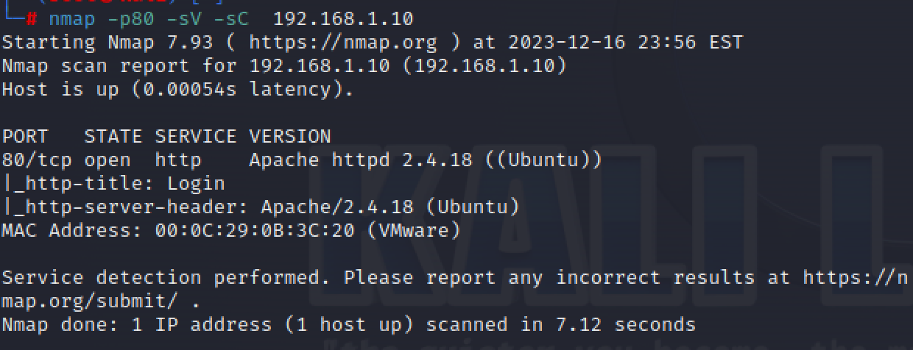
查看web页面
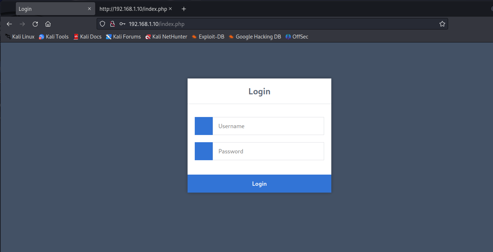
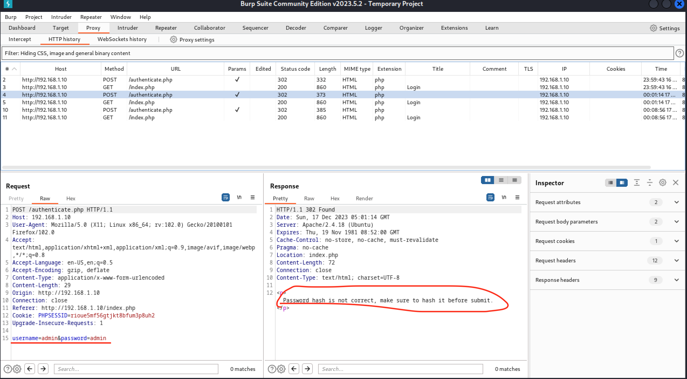
制作字典并爆破
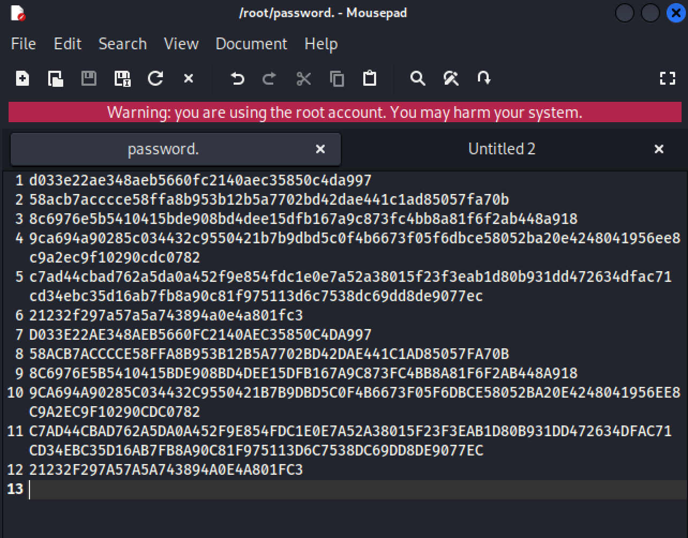
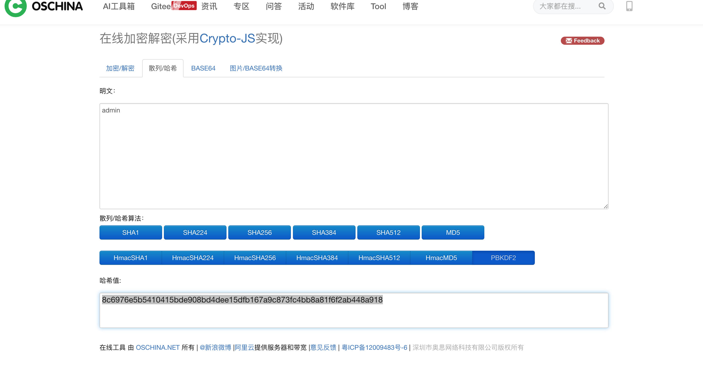
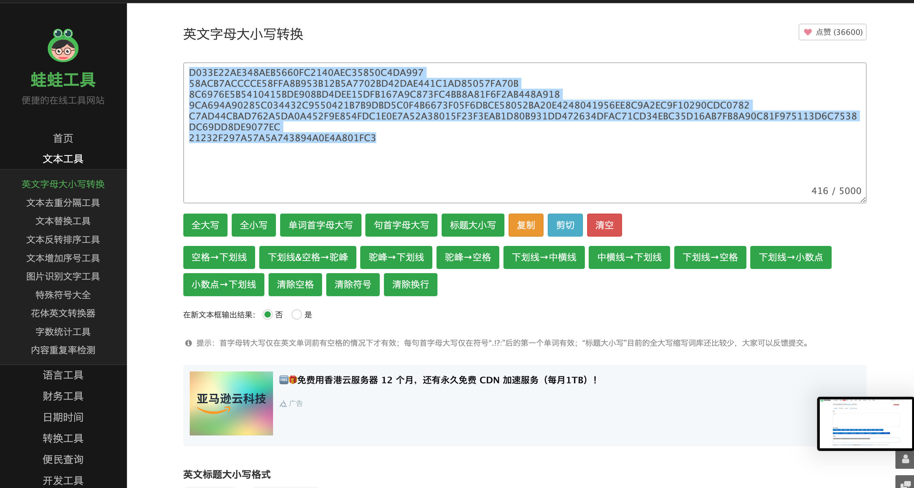
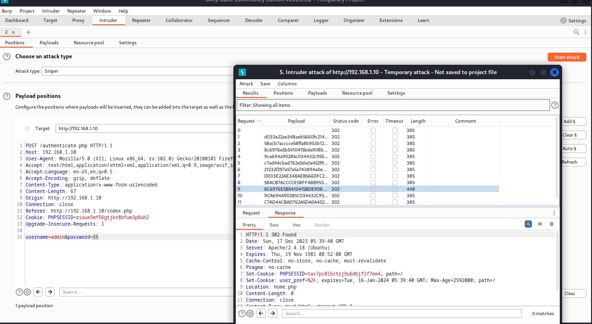
撕开口子拿shell
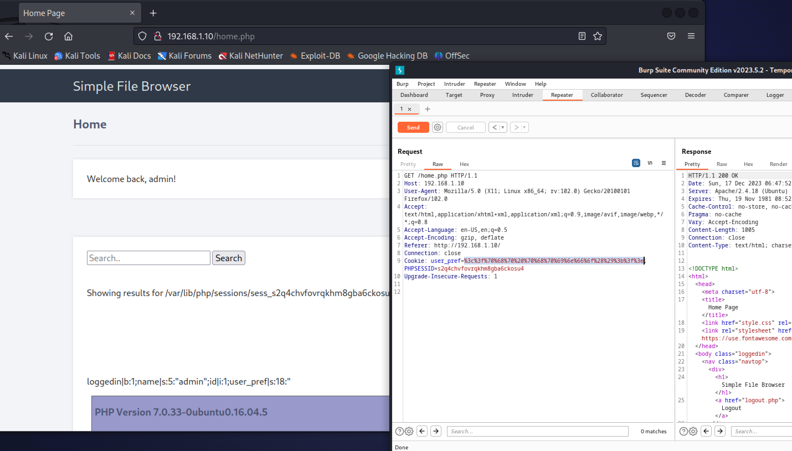
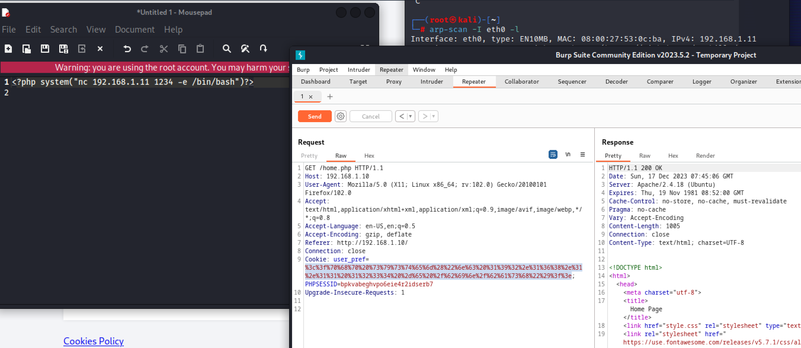
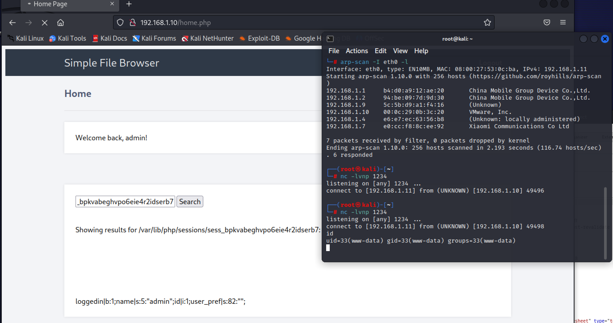
提权
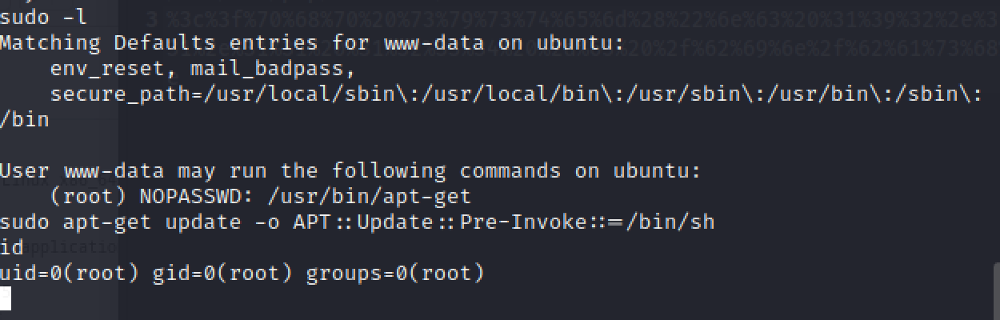
# 总结反思
1. 靶机真短
2. 不过session注入是一个非常好的思路
3. user_pref什么的，还有sudo-l只执行apt-get太刻意了
# 参考资料
> 学校资料
> https://ab-alex.github.io/2019/06/11/php%E4%BB%A3%E7%A0%81%E5%AE%A1%E8%AE%A1%E4%B9%8B%E6%96%87%E4%BB%B6%E5%8C%85%E5%90%AB/ session路径参考
> https://gtfobins.github.io/ 提权方式参考