# 靶机简介
>名称: Bob: 1.0.1
>作者：[c0rruptedb1t](https://www.vulnhub.com/author/c0rruptedb1t,578/)
>靶机链接1:https://www.vulnhub.com/entry/bob-101,226/
>靶机链接2:[http://c0rruptedb1t.com/vms/bob.html](http://c0rruptedb1t.com/vms/bob.html)
>Your Goal is to get the flag in /

Hints: Remember to look for hidden info/files 

<!--more-->

# 攻击思路
## getshell
1. robots.txt泄露靶机的自带命令执行webshell
## 提权
1. 找到bob家目录下的敏感文件 和 其Document目录下的一堆敏感文件
2. 根据文件信息得到jc用户的登录口令和一个加密文件及其密码(密码放在藏头诗里面)
3. 根据加密文件得到bob用户的登录口令
4. bob用户被委派了所有的sudo权限，固能直接切换为root，也能直接查看flag
# 工具和技术
- GnuPG 最流行的数据加密,数字签名工具软件
- GPG加密的具体步骤

1. 创建密钥(公钥,私钥)
2. 公钥用来加密数据,共享给其他人,通过导出公钥实现
3. 其他人导入公钥,并加密信息发给私钥拥有者
4. 私钥解密,查看文档

其遵循OpenPGP标准，由RFC 4880定义
# 渗透过程及结果
网络情况
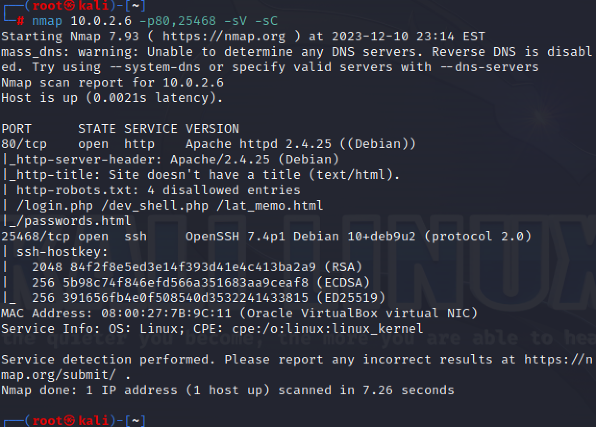
命令执行漏洞
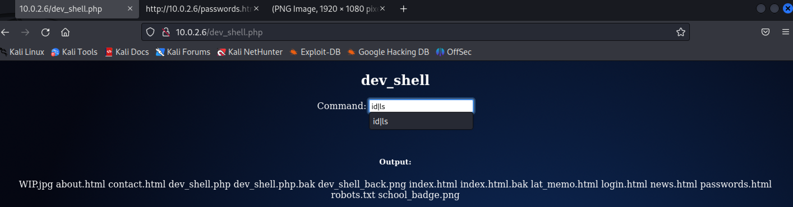
反弹shell
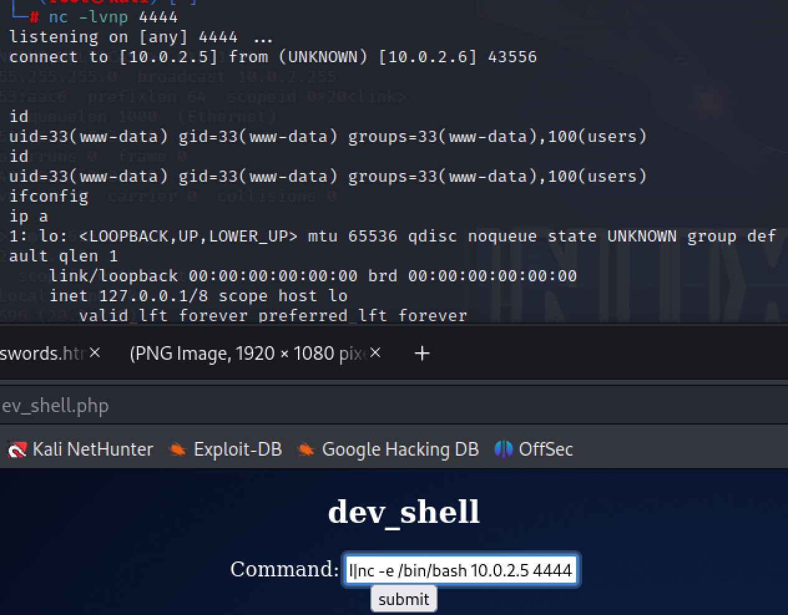
在bob家目录发现old_passwordfile
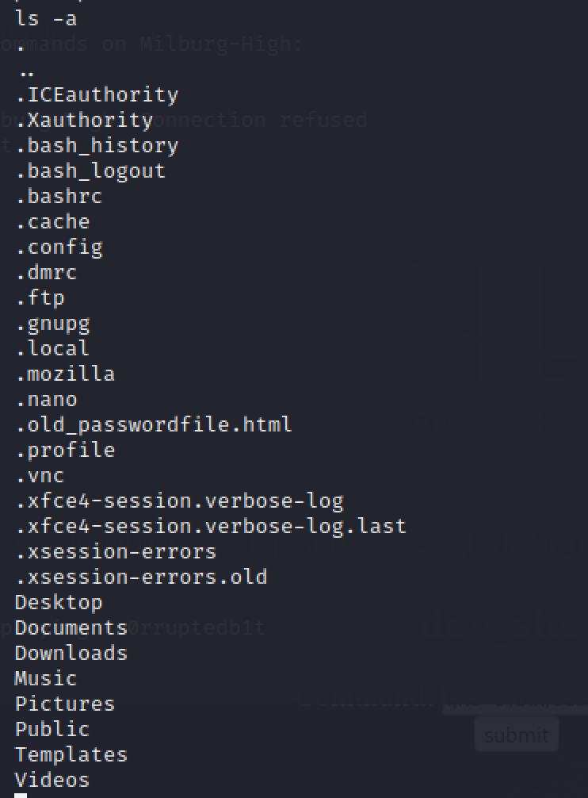
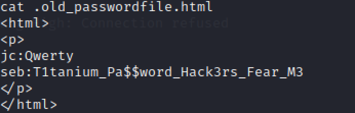
登陆jc用户
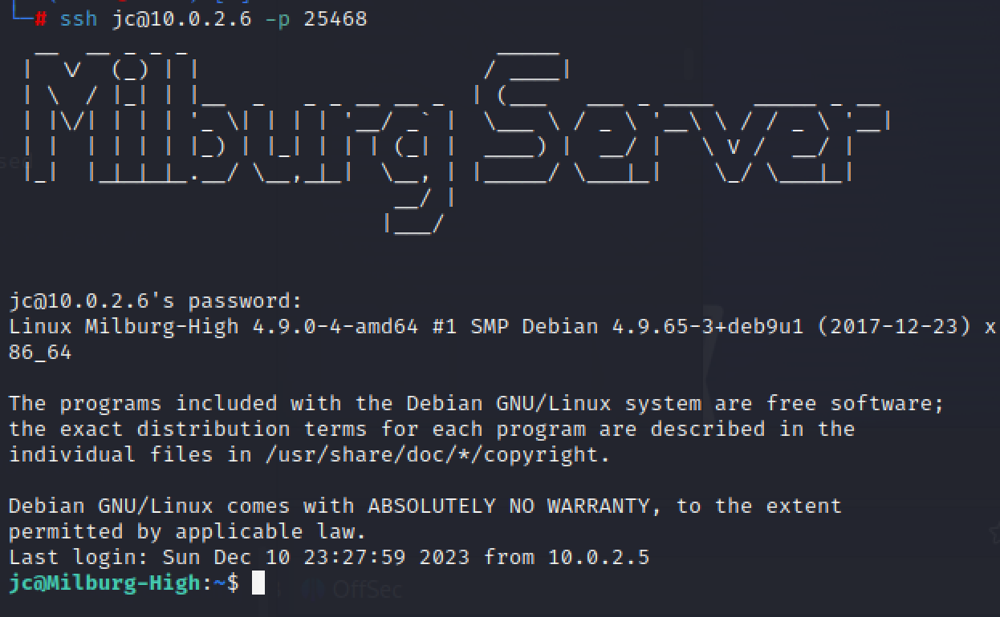
查看bob Secret目录下的内容
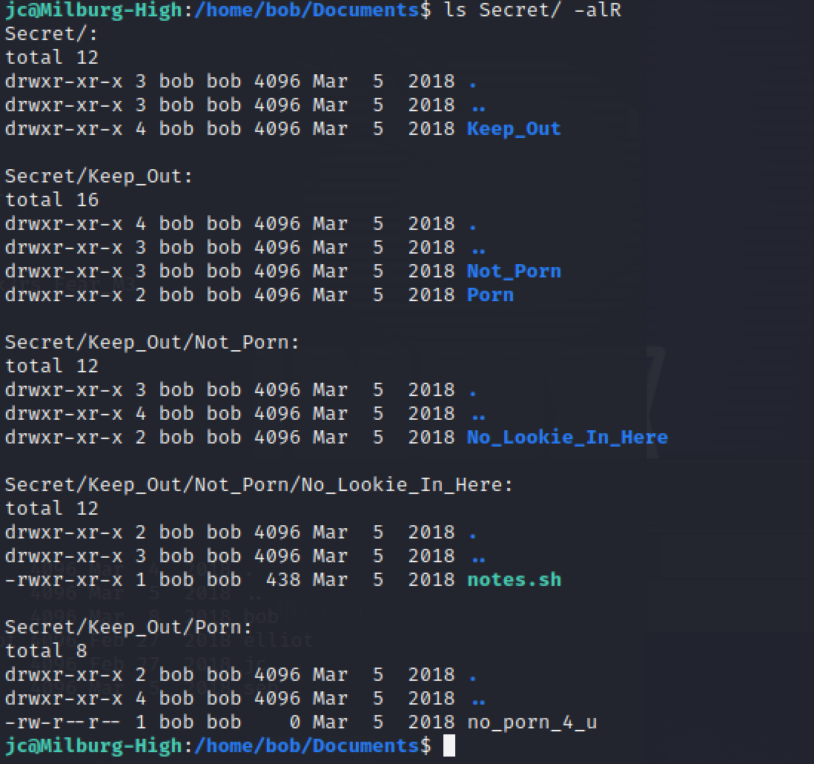
查看notes.sh内容
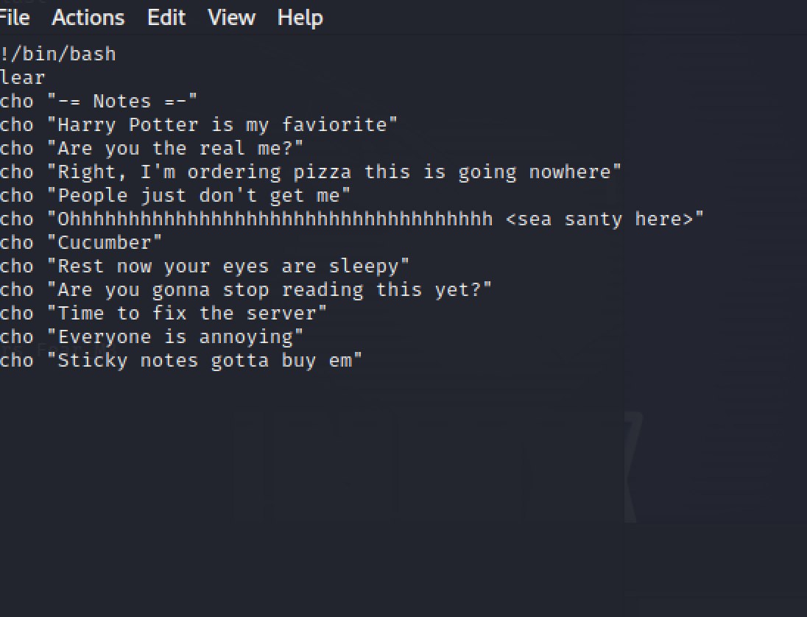
藏头诗密码解密密文
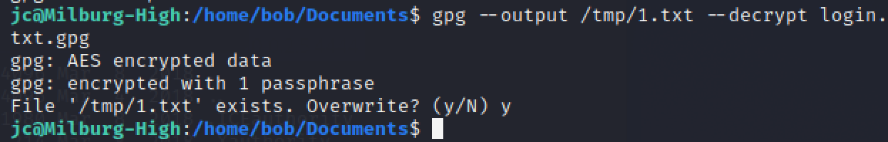
密文内容
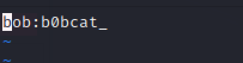
登陆bob
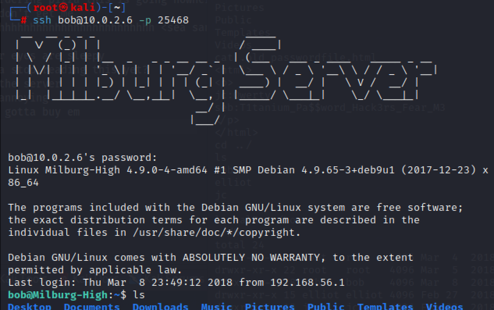
提权，sudo的可用权限大的很
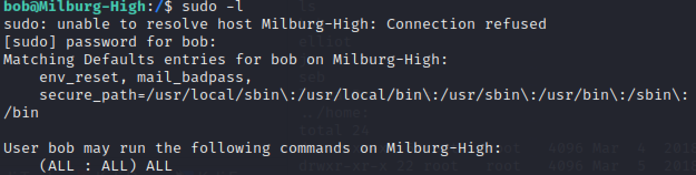
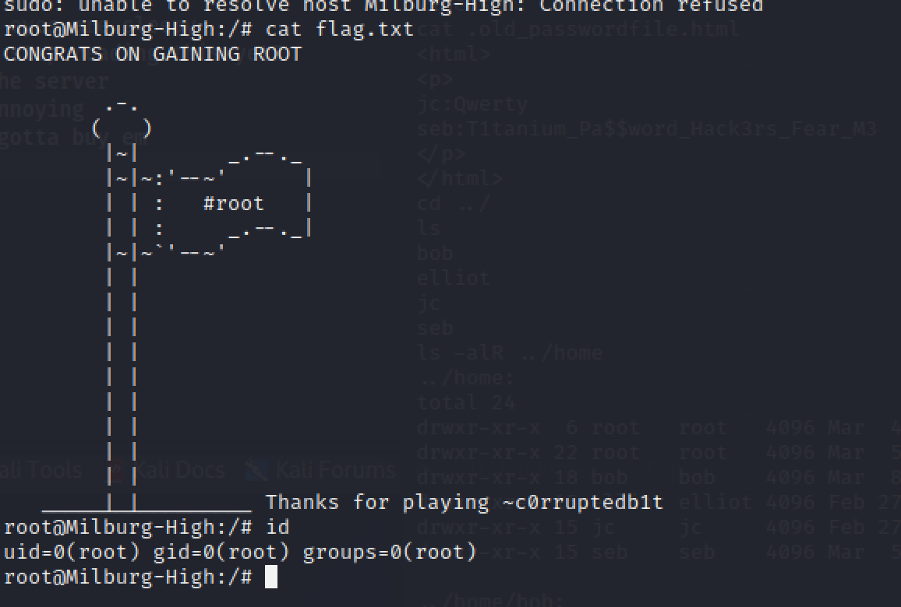

# 总结反思
1. 靶机唯二的难点在于找文件和看藏头诗，都是凭借经验和脑洞灵感之类的东西
2. gpg加密这门技术对我来说比较新鲜
3. 像什么藏头诗、字谜什么的内容可以尝试玩一玩练一练
# 参考资料
>学校给的资料
>https://www.gnupg.org/
>https://www.openpgp.org/