# 靶机简介
>靶机链接： https://www.vulnhub.com/entry/dc-2,311/
>靶机链接： [http://www.five86.com/dc-2.html](http://www.five86.com/dc-2.html)
>系列：- [DC](https://www.vulnhub.com/series/dc,199/)

# 攻击流程
## getshell
1. 绑定ip和域名
2. 通过wpscan获取用户名，并用cewl获取密码，制作成两个字典
3. msf爆破，得到两个账户
4. 通过其中一个账户，得到shell
## 提权
1. 绕过rbash
2. 尝试切换另一个账户，成功
3. sudo -l发现git的委派权限
4. git提权
# 工具和技术
>cewl通过爬虫生成字典
>rbash绕过
# 渗透过程及结果
查看网络
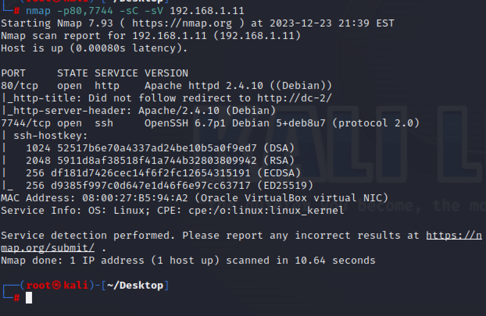
绑定域名和ip
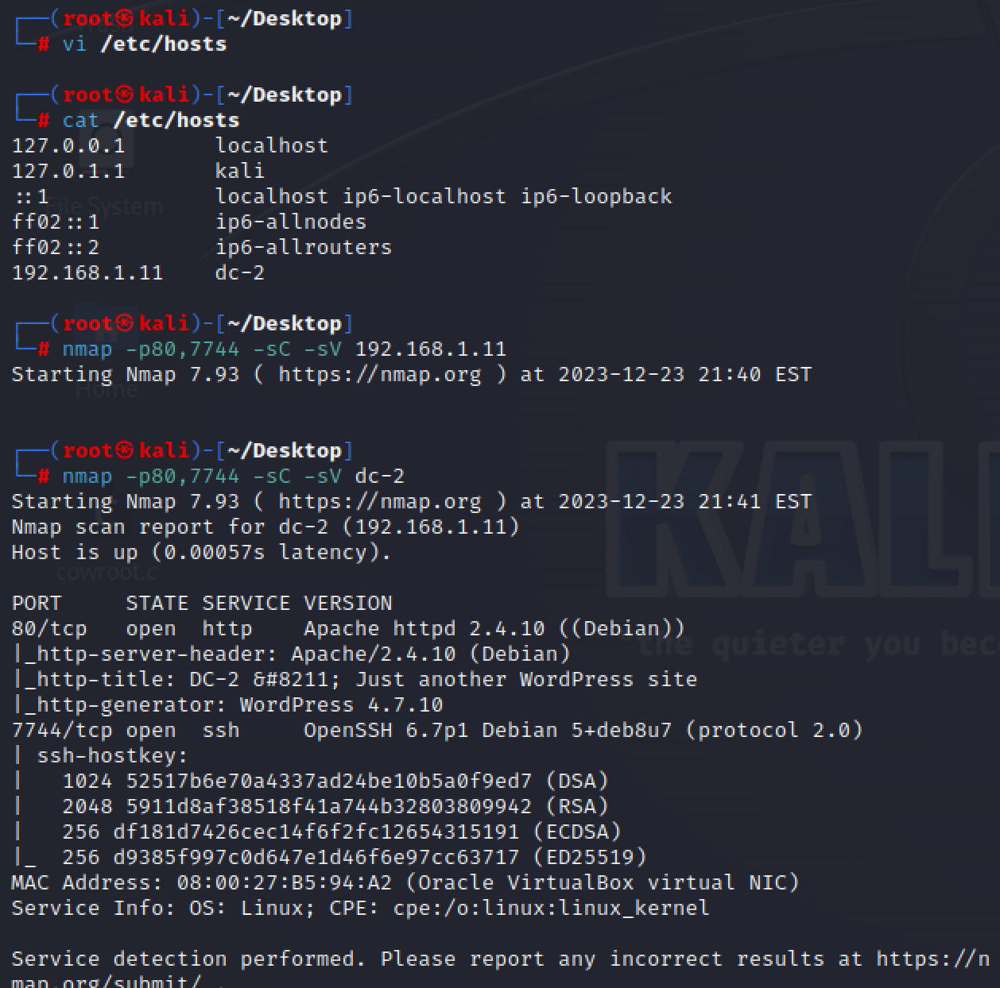
第一个flag
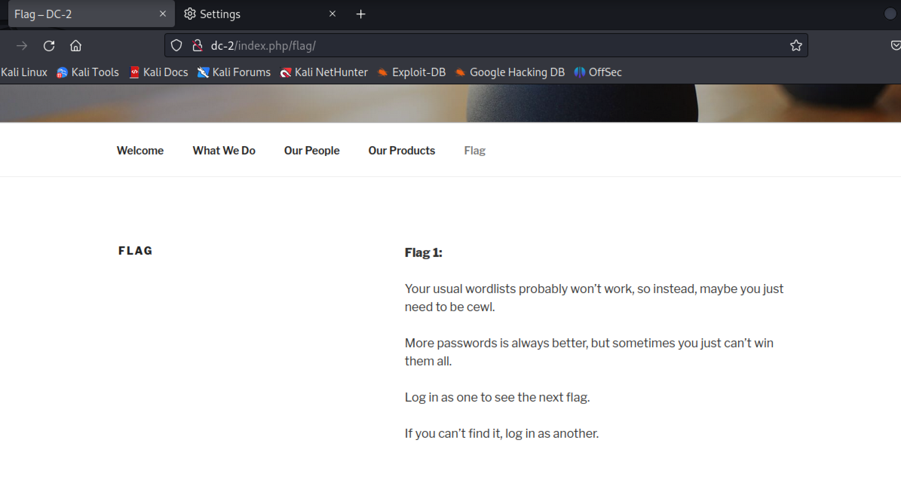
制作网站登录爆破字典，爆出账户密码
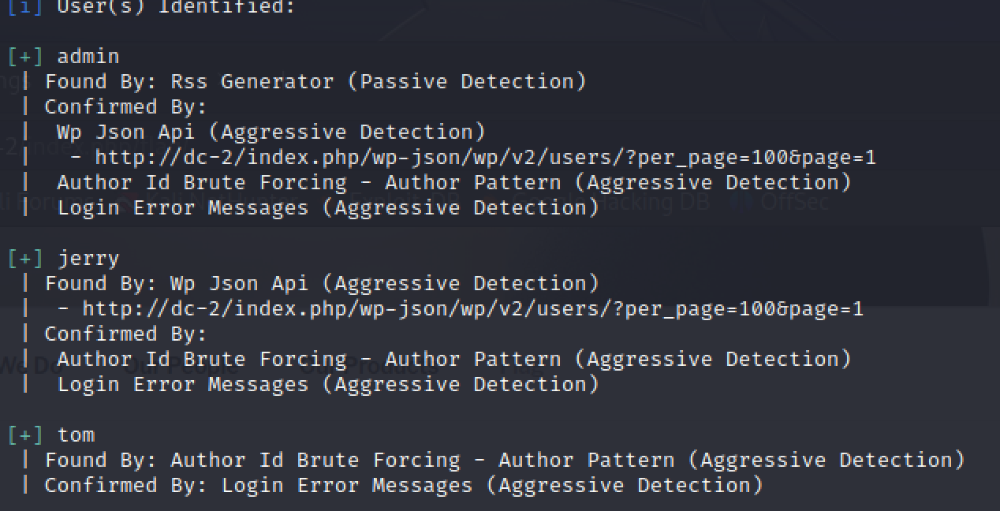
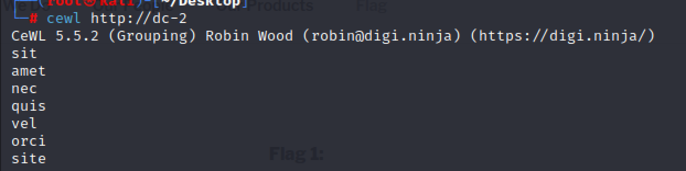
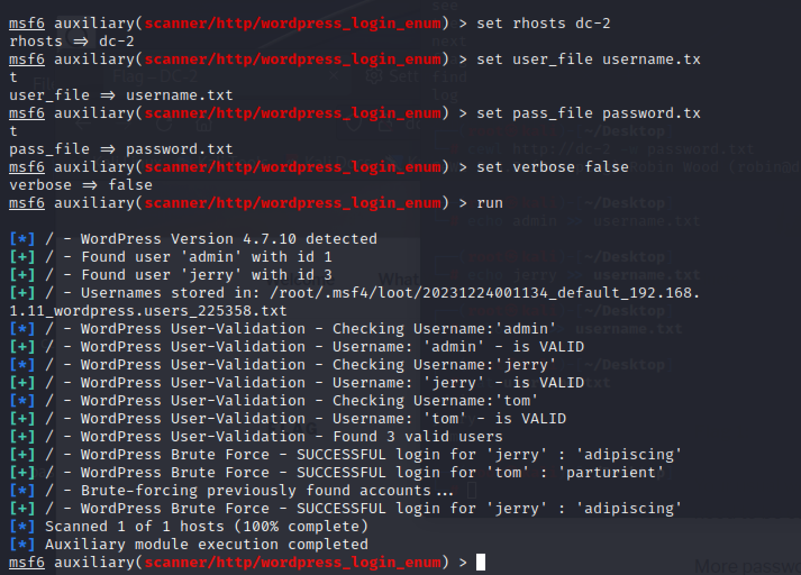
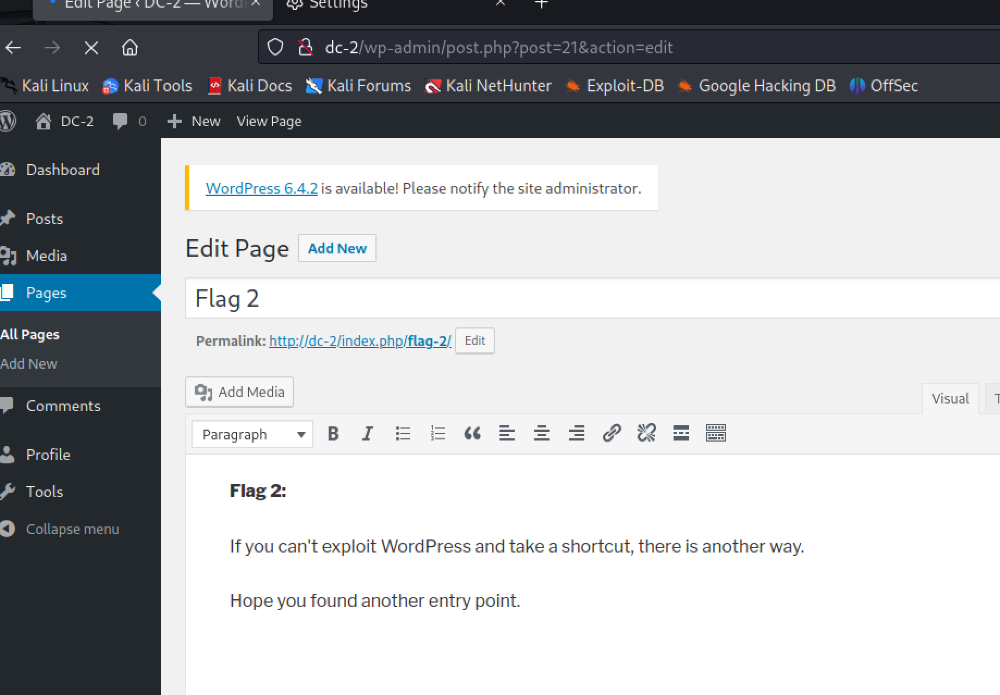
拿shell
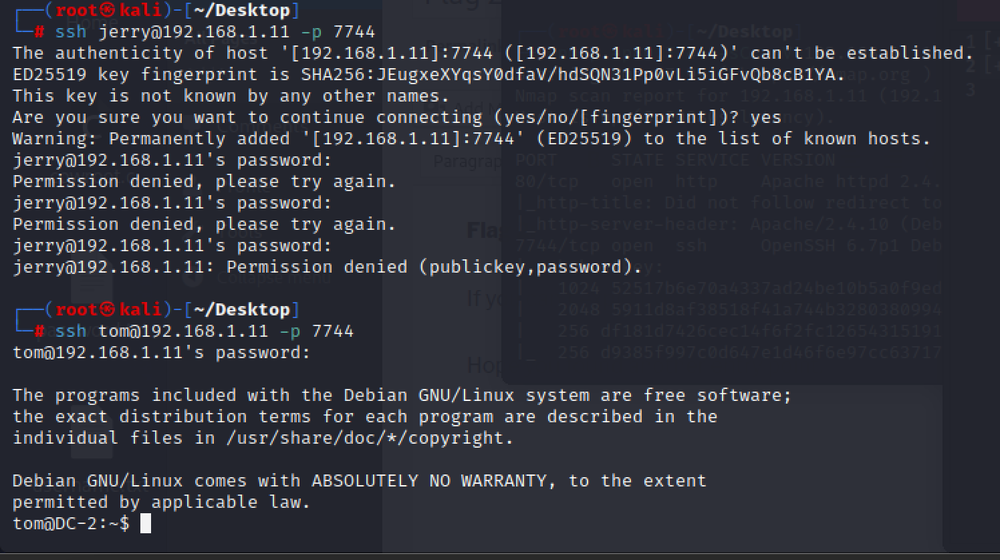
提权
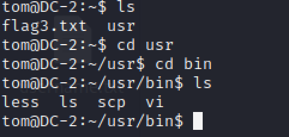
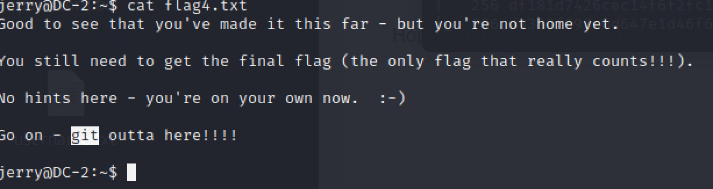
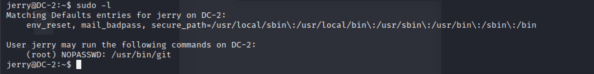
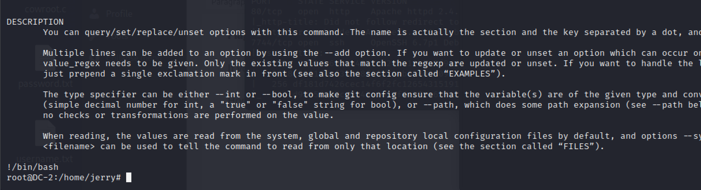
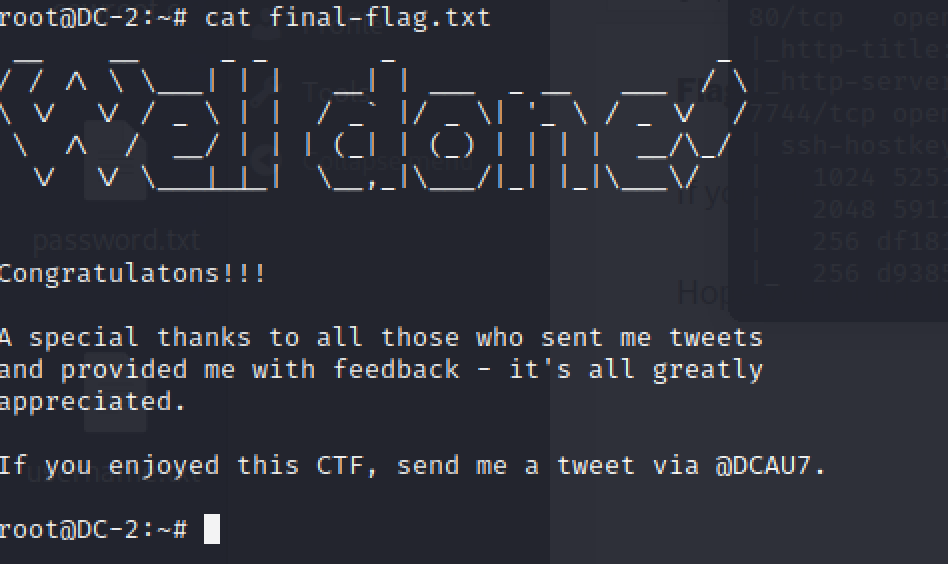
# 总结反思
在打DC-2的时候，在最后的提权阶段，感受到了急躁
首先就是，在得到了flag2，得到了两个用户和密码的时候，没有去试ssh，而是先去看了writeup
然后就是里面cd命令回显rbash的时候，没有首先去搜rbash，而是去看了一眼writeup
最后就是，绕过rbash之后，也没有尝试使用su进行用户切换，而是去看了一眼writeup
受不了了

1. 不要放过任何的回显
2. 尝试每一个账户，在可登录的任何地方
3. 每每感受到了障碍，就明晰进入下一步可能可以做什么？需要什么信息？当前有什么信息？可以用信息来干嘛？
# 参考资料
>https://gtfobins.github.io/gtfobins/git/#sudo 提权
>https://cloud.tencent.com/developer/article/1720937 修改环境变量中的PATH
>https://www.freebuf.com/articles/system/188989.html rbash绕过