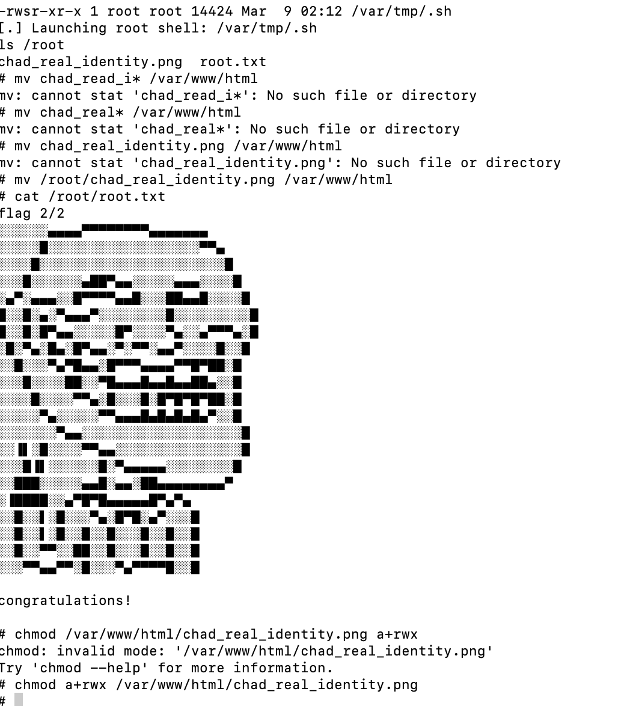
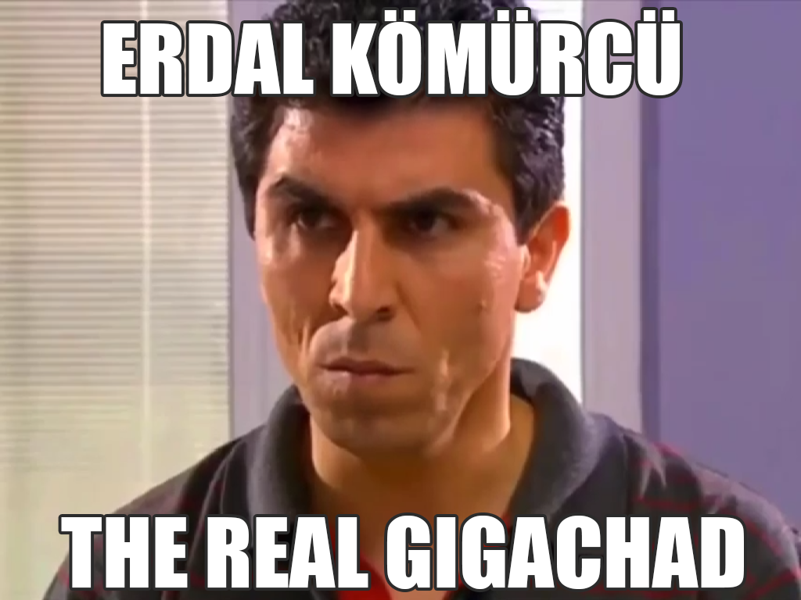

靶机地址:https://www.vulnhub.com/entry/gigachad-1,657/

# 要点
1. 开启的ftp服务是能匿名登录的
2. 根据ftp里那个的提示，了解了一个username，可以从web上获取一张藏有密码提示的图片
3. 图片里没有用到隐写，应该去google上搜图
4. find可以找到，靶机里有个s-nail-privsec的SUID文件，在exploitdb上找相关的exp就能提权

文章讲解：
https://nepcodex.com/2021/07/gigachad-walkthrough-vulnhub-writeup/
https://bugzilla.redhat.com/show_bug.cgi?id=CVE-2017-5899
# 结果



# 有趣的东西
## the real gigachad
关于靶机根目录里留下的图片，可以获取一下信息：
```
演员的维基介绍 https://tr.wikipedia.org/wiki/Sefa_Zengin

2003-2004 - Kurtlar Vadisi - Erdal Kömürcü

土耳其惡狼谷 英文名:Valley of the Wolves 土耳其名:Kurtlar Vadisi
Erdal Kömürcü是该系列的一名角色
```
大多数是土耳其语，并且目前的翻译软件比较垃圾，又懒得看，就只能给出这点东西了
## rabbit hole
dirsearch 扫描web的时候会冒出来一堆莫名其妙的东西，我也不知道这个叫什么，在 https://nepcodex.com/2021/07/gigachad-walkthrough-vulnhub-writeup/ 里被叫做兔子洞，但我直接搜会搜到别的东西

https://rabbithole.gg/
web3，学不会一点（−＿−；）