# hackademic RTB1_靶机名_writeup
这是学校课程的作业，《红队/渗透 — 和我一起来打靶》也涉及了该靶机
<!--more-->
# 靶机简介

> 靶机名：hackademic RTB1
> 靶机链接：https://www.vulnhub.com/entry/hackademic-rtb1,17/
> 描述：This is the first realistic hackademic challenge (root this box) by mr.pr0n
	Download the target and get root.
	After all, try to read the contents of the file 'key.txt' in the root directory.
	Enjoy!

# 攻击流程
ps:具体攻击过程请看**渗透过程及结果**
## 信息搜集
1. nmap扫描端口发现80端口开放，访问自动跳转目录Hackerademic_RTB1
2. dirsearch目录遍历，发现文件夹wp-admin，进入后台登陆页面
3. 访问网页首页，依次点击直到点击`Uncategoried`，发现参数cat，是有sql注入漏洞的
## 拿shell
1. sqlmap注入后，查看wordpress数据库下的wp_users，获取网站用户和密码的hash值，通过sqlmap的自带功能爆破hash值获得密码
2. GerogeMiller用户的权限较大，登陆后的网页东西更多，可以更改网站设置选项，其中有`是否开启upload`的选项，也可以设定上传文件的允许格式，这里添加php
3. 上传kali自带的php反弹shell脚本，目录为`/usr/share/webshells/php/php-reverse-shell.php`，修改脚本的ip和端口参数为渗透机
4. 本地nc开启端口监听；网站上传完文件后会提示上传到了哪个目录，直接访问，和本地nc的监听端口连接，getshell
## 提权
1. `sudo -l`发现当前的用户不是sudoer
2. 寻找suid可执行文件，也没有找到能用的
3. `uname -a`查看当前靶机内核版本，`2.6.31.5-127.fc12.1686`
4. `searchsploit 2.6.3|grep "Local Pri"`寻找内核漏洞提取脚本，cp到`/var/www/html`
5. 渗透机开启apache服务，在拿到的shell上用`wget`下载内核漏洞脚本，并用靶机的gcc命令编译执行
6. 15285.c这个脚本可以root靶机 `Linux Kernel 2.6.36-rc8 - 'RDS Protocal' Local Privilege Escalation`
# 工具和技术

> nmap
> dirsearch
> sqlmap
> kali自带的反弹shell脚本和提取脚本
> nc监听端口
> 通过渗透机的apache网站下载脚本至靶机
> `searchsploit`
> 内核提取漏洞

# 渗透过程及结果
1. 信息搜集
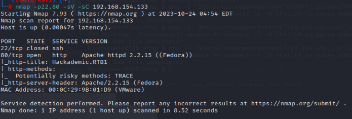
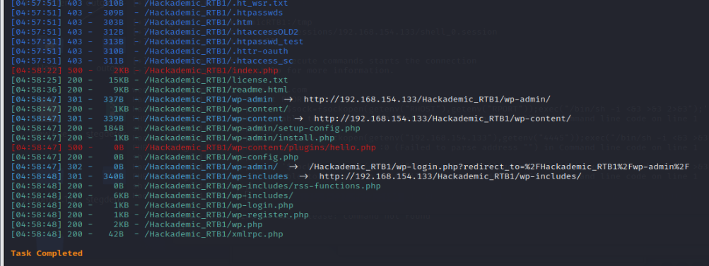
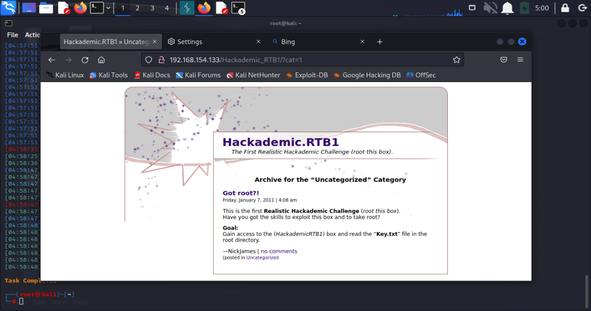
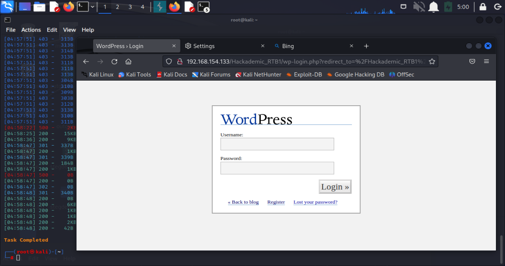
2. sqlmap注入
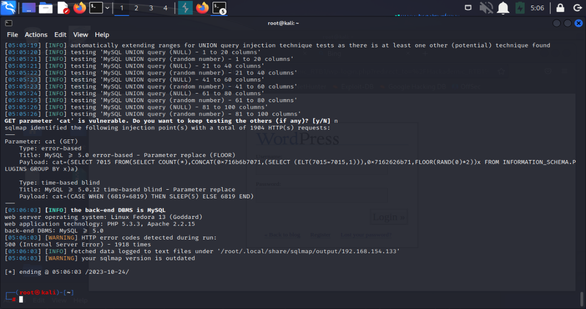
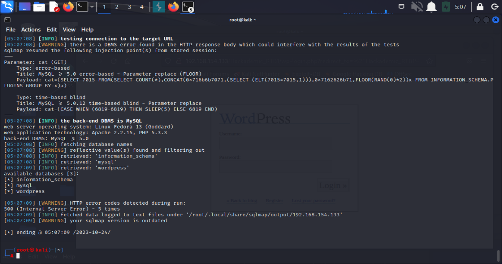
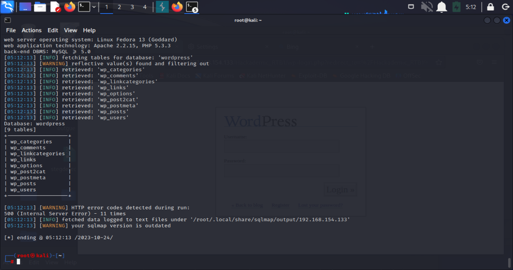
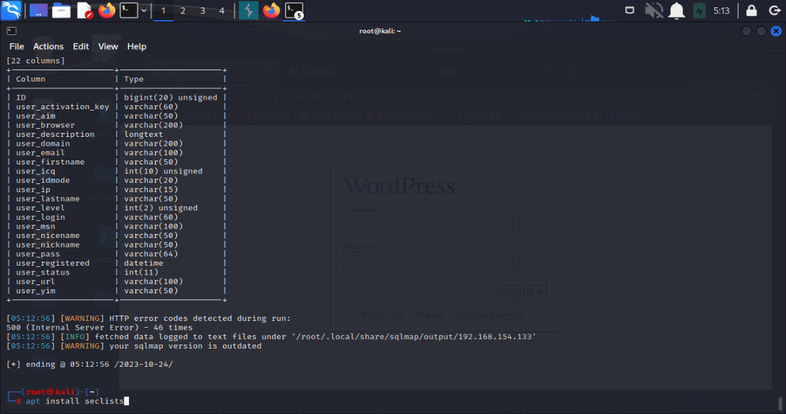
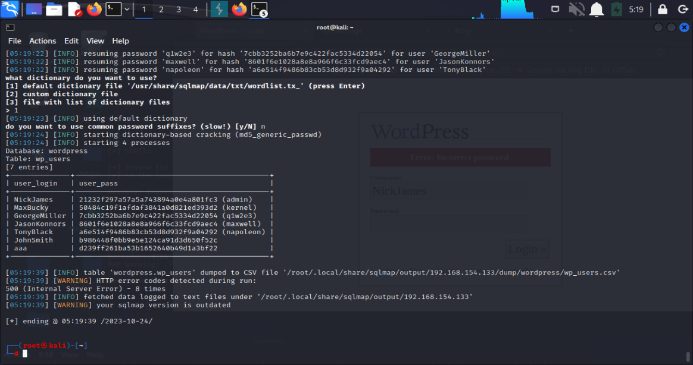
3. 上传webshell
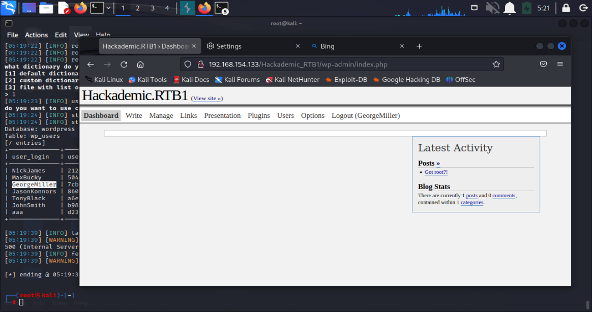
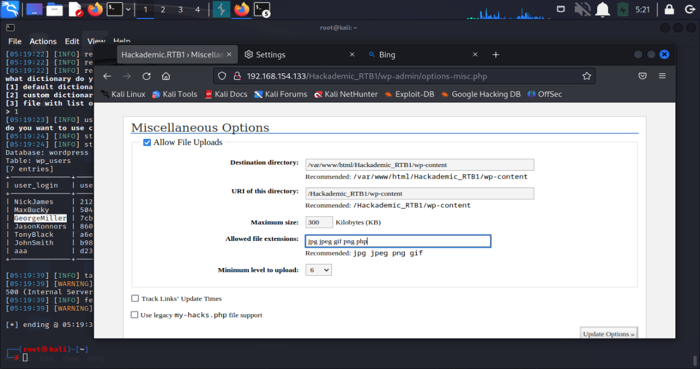
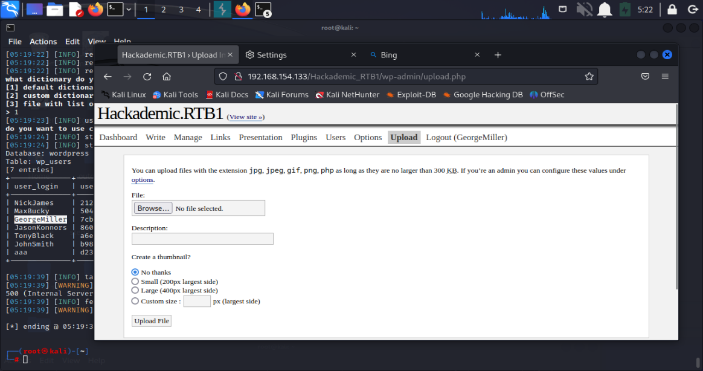
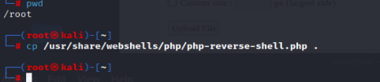
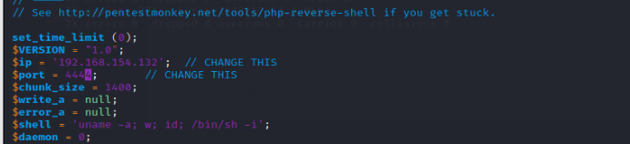
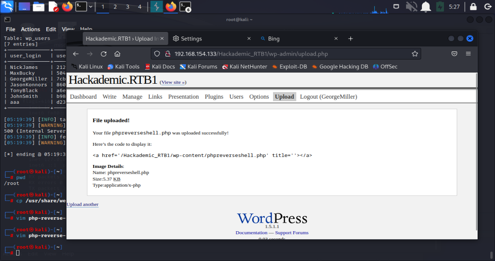
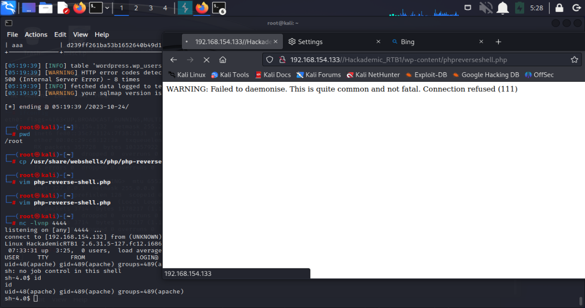
4. getshell和普通的信息搜集
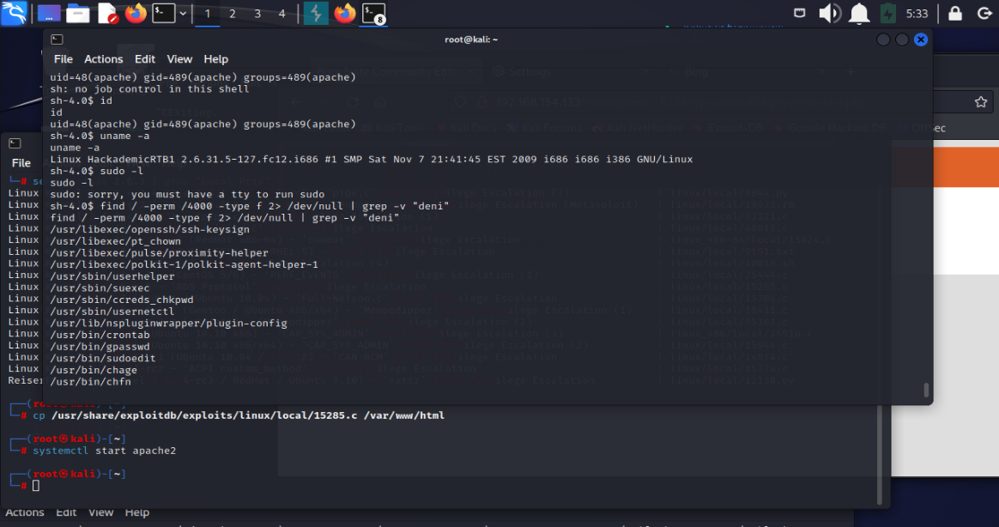
5. 内核漏洞测试，root靶机
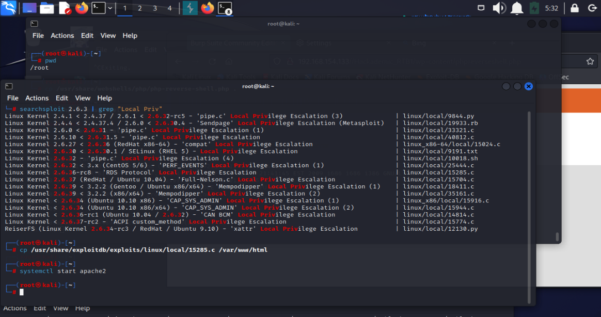
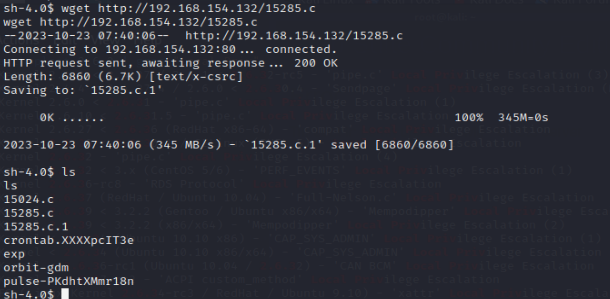
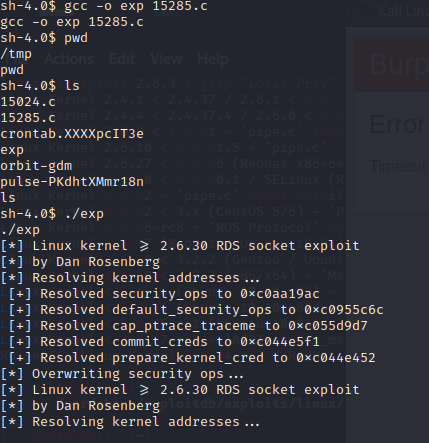
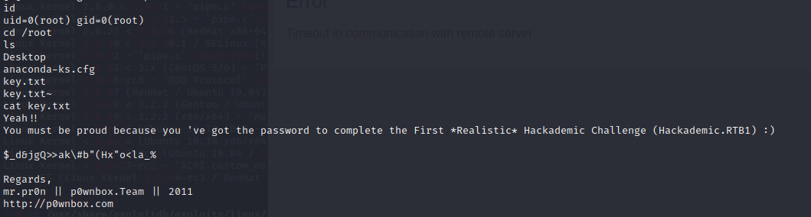
# 总结反思

> 首先，sqlmap确实是很好用的工具，尤其对我这种手注基础薄弱的人来说更是如此，这是我的短板
> kali的自带脚本十分的有用，我应该多多了解一下的
> 内核漏洞是十分基础和重要的漏洞利用方式，但是根据系统内核版本模糊地查询漏洞脚本一个一个试——太累了、太慢了、太粗糙了，摸索或学习一套快速方便的工作流因此而言是十分重要的
> 关于内核漏洞的原理，这东西可钻研的东西可多了，但如果真的要学习这个东西：需要扎实的计算机构成原理、系统运行方式基础，这些东西我根本没有

# 参考资料

> 学校给的writeup